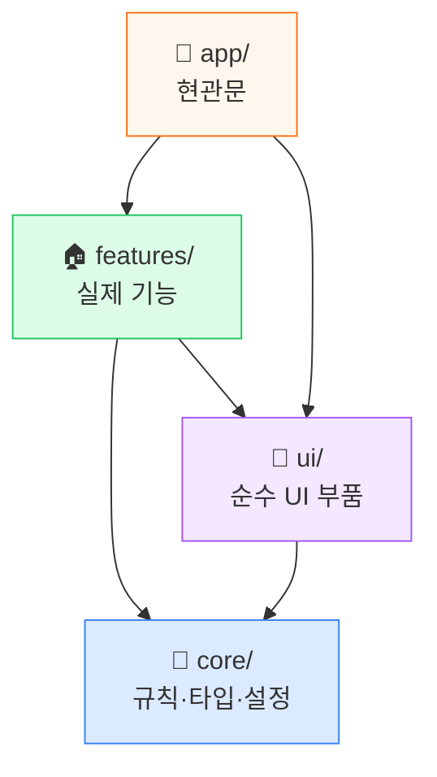
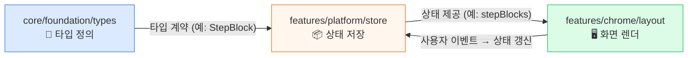
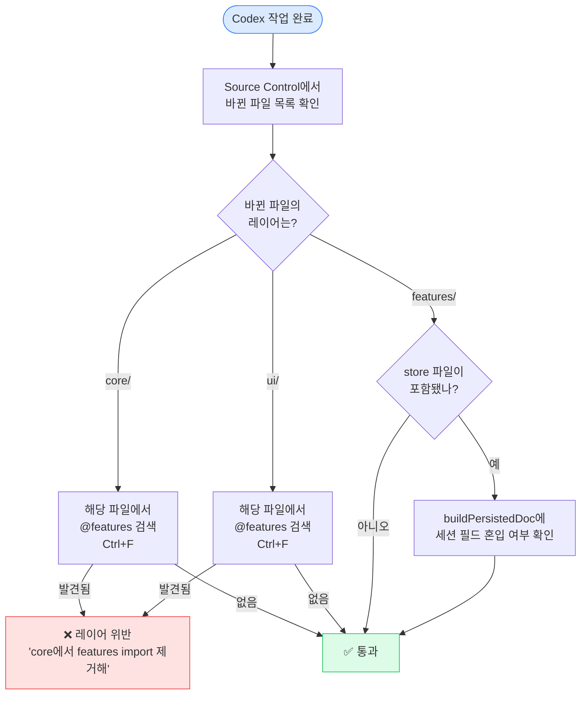

이 문서는 코드 설명 문서가 아니라,
구조 관찰 및 AI 통제 훈련용 운영 매뉴얼이다.

# SY-Math-Slate 구조 학습 시스템

> 코드를 읽는 사람이 아니라, **구조를 보고 AI에게 정확한 지시를 내리는 사람**이 되기 위한 반복 시스템.

---

## 이 레포의 지도

먼저 이것만 머리에 넣는다. 실제 코드는 전부 `v10/src/` 안에 있다.

```
v10/src/
  app/                      🚪 현관문 — 사용자가 처음 들어오는 곳
    api/                      서버 API (AI·공유·trust·커뮤니티)
  core/                     🧱 기초 — 기능이 가져다 쓰는 규칙·계약
    foundation/               정책·타입·스키마·레지스트리
    runtime/                  명령 실행·mod 런타임·플러그인
      modding/                  mod 런타임 네임스페이스 (api/package/host/builtin)
    domain/                   수학 도메인 로직
    pipelines/                저장·내보내기·마이그레이션
    security/                 HTML 소독
    ui/theming/               테마 엔진·토큰·프리셋
  features/                 🏠 실제 기능 구현
    editor/                   ✏️ 캔버스·입력·애니메이션·에디터 코어
    chrome/                   🖼️ 앱 쉘·툴바·레이아웃·뷰어·단축키·테마UI
    collaboration/            🤝 공유·라이브 싱크
    governance/               🏛️ 정책·심사·커뮤니티
    platform/                 ⚙️ store·hooks·Mod Studio·확장·관측
  ui/                       🎨 순수 UI 부품 (버튼·다이얼로그·ErrorBoundary)
  mod/                      📦 템플릿 팩 시스템
    packs/                    팩 구현 (base-education 등)
    bridge/                   팩↔런타임 연결
    schema/                   팩 계약 타입·가드
```

**절대 규칙**: `core`는 아무것도 안 가져옴 → `features`는 `core`를 가져옴 → `app`은 전부 가져옴.
이 방향이 거꾸로 되면 버그의 원인이 된다.



### 구조 이해에 결정적인 파일들

#### 🧱 핵심 레이어 (core)
| 파일 | 역할 | 신호 키워드 |
|---|---|---|
| [canvas.ts](file:///wsl.localhost/Ubuntu/home/sykab/SY-Math-Slate/v10/src/core/foundation/types/canvas.ts) | 모든 데이터의 모양 정의 | `type`, `interface`, `StepBlock`, `CanvasItem` |
| [boardSpec.ts](file:///wsl.localhost/Ubuntu/home/sykab/SY-Math-Slate/v10/src/core/foundation/policies/boardSpec.ts) | 보드 크기/여백 상수 | `BOARD_WIDTH`, `BOARD_HEIGHT`, `export const` |
| [rolePolicy.ts](file:///wsl.localhost/Ubuntu/home/sykab/SY-Math-Slate/v10/src/core/foundation/policies/rolePolicy.ts) | 호스트/학생 권한 규칙 | `host`, `student`, `deny`, `allow` |
| [commandBus.ts](file:///wsl.localhost/Ubuntu/home/sykab/SY-Math-Slate/v10/src/core/runtime/command/commandBus.ts) | 모든 명령이 지나가는 중앙 통로 | `execute`, `preflight`, `command`, `dispatch` |

#### 📦 핵심 상태 (store)
| 파일 | 역할 | 신호 키워드 |
|---|---|---|
| [useCanvasStore.ts](file:///wsl.localhost/Ubuntu/home/sykab/SY-Math-Slate/v10/src/features/platform/store/useCanvasStore.ts) | 메인 기억 저장소. 페이지, 스텝, 그림 전부 여기 | `pages`, `stepBlocks`, `currentStep`, `addStroke` |
| [useDocStore.ts](file:///wsl.localhost/Ubuntu/home/sykab/SY-Math-Slate/v10/src/features/platform/store/useDocStore.ts) | 저장되는 문서 데이터 | `pages`, `pageOrder`, `anchorMap`, `persist` |
| [useSyncStore.ts](file:///wsl.localhost/Ubuntu/home/sykab/SY-Math-Slate/v10/src/features/platform/store/useSyncStore.ts) | 호스트↔학생 공유 상태 | `globalStep`, `laserPosition`, `remotePresences` |
| [useLocalStore.ts](file:///wsl.localhost/Ubuntu/home/sykab/SY-Math-Slate/v10/src/features/platform/store/useLocalStore.ts) | 이 기기에서만 쓰는 상태 | `role`, `isPanelOpen`, `localViewport` |
| [useChromeStore.ts](file:///wsl.localhost/Ubuntu/home/sykab/SY-Math-Slate/v10/src/features/platform/store/useChromeStore.ts) | UI 토글 (패널 열기/닫기 등) | `isDataInputOpen`, `isFullscreen`, `toggle` |
| [useToolStore.ts](file:///wsl.localhost/Ubuntu/home/sykab/SY-Math-Slate/v10/src/features/platform/store/useToolStore.ts) | 지금 선택된 도구 (펜, 레이저 등) | `activeTool`, `penColor`, `penWidth` |

#### 🖥️ 핵심 화면 진입점
| 파일 | 역할 | 신호 키워드 |
|---|---|---|
| [page.tsx](file:///wsl.localhost/Ubuntu/home/sykab/SY-Math-Slate/v10/src/app/page.tsx) | 앱의 첫 페이지 | `export default`, `return` |
| [AppLayout.tsx](file:///wsl.localhost/Ubuntu/home/sykab/SY-Math-Slate/v10/src/features/chrome/layout/AppLayout.tsx) | 화면 전체 뼈대 | `<Canvas`, `<Toolbar`, `<Panel`, `return (` |
| [WindowHost.tsx](file:///wsl.localhost/Ubuntu/home/sykab/SY-Math-Slate/v10/src/features/chrome/layout/windowing/WindowHost.tsx) | 패널/창 관리자 | `window`, `panel`, `mount`, `render` |
| [panelAdapters.tsx](file:///wsl.localhost/Ubuntu/home/sykab/SY-Math-Slate/v10/src/features/chrome/layout/windowing/panelAdapters.tsx) | 패널에 실제 기능을 연결 | `DataInputPanel`, `Prompter`, `FloatingToolbar` |

#### ⚙️ 핵심 계산/레이아웃 로직
| 파일 | 역할 | 신호 키워드 |
|---|---|---|
| [autoLayout.ts](file:///wsl.localhost/Ubuntu/home/sykab/SY-Math-Slate/v10/src/features/chrome/layout/autoLayout.ts) | 블록 → 페이지 배치 계산 | `stepBlocks`, `pages`, `anchorMap`, `overflow`, `measureStep` |
| [useSequence.ts](file:///wsl.localhost/Ubuntu/home/sykab/SY-Math-Slate/v10/src/features/platform/hooks/useSequence.ts) | 재생 엔진 | `currentStep`, `nextStep`, `autoPlay`, `audio` |
| [usePersistence.ts](file:///wsl.localhost/Ubuntu/home/sykab/SY-Math-Slate/v10/src/features/platform/hooks/usePersistence.ts) | 자동 저장 | `save`, `hydrate`, `autosave`, `debounce` |
| [useFileIO.ts](file:///wsl.localhost/Ubuntu/home/sykab/SY-Math-Slate/v10/src/features/platform/hooks/useFileIO.ts) | .slate 파일 내보내기/불러오기 | `export`, `import`, `manifest`, `board.json` |

#### 🔌 확장 포인트 (extensions / contracts)
| 파일 | 역할 | 신호 키워드 |
|---|---|---|
| [normalizedContent.ts](file:///wsl.localhost/Ubuntu/home/sykab/SY-Math-Slate/v10/src/core/foundation/schemas/normalizedContent.ts) | 콘텐츠 교환 계약 | `NormalizedContent`, `validate`, `guard` |
| [toolRegistry.ts](file:///wsl.localhost/Ubuntu/home/sykab/SY-Math-Slate/v10/src/core/foundation/schemas/toolRegistry.ts) | 도구 등록 계약 | `ToolRegistry`, `register`, `lookup` |
| [pluginLoader.ts](file:///wsl.localhost/Ubuntu/home/sykab/SY-Math-Slate/v10/src/core/runtime/plugin-runtime/pluginLoader.ts) | 플러그인 검증/로드 | `manifest`, `validate`, `slot`, `button`, `panel` |
| [mcpGateway.ts](file:///wsl.localhost/Ubuntu/home/sykab/SY-Math-Slate/v10/src/core/runtime/plugin-runtime/mcpGateway.ts) | 외부 AI 도구 통신 | `postMessage`, `call_tool`, `handshake`, `origin` |
| [connectors.ts](file:///wsl.localhost/Ubuntu/home/sykab/SY-Math-Slate/v10/src/core/runtime/plugin-runtime/connectors.ts) | 도구 연결 경로 | `adapter`, `invoke`, `ToolResult`, `lookup` |
| [registerCoreCommands.ts](file:///wsl.localhost/Ubuntu/home/sykab/SY-Math-Slate/v10/src/features/platform/extensions/commands/registerCoreCommands.ts) | 핵심 명령어 등록 | `insertBlock`, `deleteBlock`, `COMMAND_MIGRATION_MAP` |

#### ✏️ 에디터 핵심 (editor)
| 파일 | 역할 | 신호 키워드 |
|---|---|---|
| [CanvasStage.tsx](file:///wsl.localhost/Ubuntu/home/sykab/SY-Math-Slate/v10/src/features/editor/canvas/CanvasStage.tsx) | 그림판 최상위 렌더 | `stage`, `canvas`, `layers`, `render` |
| [ContentLayer.tsx](file:///wsl.localhost/Ubuntu/home/sykab/SY-Math-Slate/v10/src/features/editor/canvas/ContentLayer.tsx) | 콘텐츠 렌더 레이어 | `StepBlock`, `layer`, `render` |
| [MathTextBlock.tsx](file:///wsl.localhost/Ubuntu/home/sykab/SY-Math-Slate/v10/src/features/editor/canvas/MathTextBlock.tsx) | 수식 텍스트 블록 | `MathText`, `block`, `LaTeX` |
| [editorSurface.ts](file:///wsl.localhost/Ubuntu/home/sykab/SY-Math-Slate/v10/src/features/editor/editor-core/model/editorSurface.ts) | 에디터 표면 모델 | `surface`, `selection`, `caret` |
| [compileAnimationPlan.ts](file:///wsl.localhost/Ubuntu/home/sykab/SY-Math-Slate/v10/src/features/editor/animation/plan/compileAnimationPlan.ts) | 재생 계획 컴파일 | `compile`, `plan`, `steps`, `animation` |
| [useInputStudioHeadless.ts](file:///wsl.localhost/Ubuntu/home/sykab/SY-Math-Slate/v10/src/features/editor/input-studio/hooks/useInputStudioHeadless.ts) | 구조화 입력 핵심 훅 | `input`, `studio`, `headless`, `draft` |

#### 🧩 Mod 런타임 & 템플릿 팩
| 파일 | 역할 | 신호 키워드 |
|---|---|---|
| [index.ts (modding)](file:///wsl.localhost/Ubuntu/home/sykab/SY-Math-Slate/v10/src/core/runtime/modding/index.ts) | mod 런타임 진입점 | `modding`, `ModRuntime`, `export` |
| [manager.ts](file:///wsl.localhost/Ubuntu/home/sykab/SY-Math-Slate/v10/src/core/runtime/modding/host/manager.ts) | mod 런타임 매니저 | `manager`, `register`, `activate`, `ModRuntime` |
| [registry.ts](file:///wsl.localhost/Ubuntu/home/sykab/SY-Math-Slate/v10/src/core/runtime/modding/package/registry.ts) | 패키지 레지스트리 | `registry`, `packages`, `lookup`, `PackageRegistry` |
| [packRegistryBridge.ts](file:///wsl.localhost/Ubuntu/home/sykab/SY-Math-Slate/v10/src/mod/bridge/packRegistryBridge.ts) | 팩↔런타임 연결 브릿지 | `bridge`, `pack`, `register`, `adapter` |
| [manifest.ts](file:///wsl.localhost/Ubuntu/home/sykab/SY-Math-Slate/v10/src/mod/packs/base-education/manifest.ts) | base-education 팩 매니페스트 | `manifest`, `pack`, `modules`, `id` |
| [templatePack.types.ts](file:///wsl.localhost/Ubuntu/home/sykab/SY-Math-Slate/v10/src/mod/schema/templatePack.types.ts) | 팩 계약 타입 | `TemplatePack`, `type`, `interface` |

#### 🤝 협업 (collaboration)
| 파일 | 역할 | 신호 키워드 |
|---|---|---|
| [useHostSession.ts](file:///wsl.localhost/Ubuntu/home/sykab/SY-Math-Slate/v10/src/features/collaboration/sharing/useHostSession.ts) | 호스트 세션 관리 | `host`, `session`, `students`, `share` |
| [ProposalCommandBus.ts](file:///wsl.localhost/Ubuntu/home/sykab/SY-Math-Slate/v10/src/features/collaboration/sharing/ProposalCommandBus.ts) | 학생→호스트 명령 제안 버스 | `proposal`, `approve`, `reject`, `command` |
| [useAsymmetricSessionSync.ts](file:///wsl.localhost/Ubuntu/home/sykab/SY-Math-Slate/v10/src/features/collaboration/sync/useAsymmetricSessionSync.ts) | 비대칭 세션 동기화 | `sync`, `host`, `student`, `asymmetric` |
| [backplane.ts](file:///wsl.localhost/Ubuntu/home/sykab/SY-Math-Slate/v10/src/features/collaboration/sync/realtime/backplane.ts) | 실시간 메시지 백플레인 | `backplane`, `transport`, `channel`, `realtime` |

#### 🖼️ Chrome 기타 (ui-host / shortcuts / viewer / theming-ui)
| 파일 | 역할 | 신호 키워드 |
|---|---|---|
| [modContributionBridge.ts](file:///wsl.localhost/Ubuntu/home/sykab/SY-Math-Slate/v10/src/features/chrome/ui-host/modContributionBridge.ts) | mod 툴바/패널 기여 집계 브릿지 | `contribution`, `mod`, `bridge`, `slot` |
| [useAuthoringShortcuts.ts](file:///wsl.localhost/Ubuntu/home/sykab/SY-Math-Slate/v10/src/features/chrome/shortcuts/useAuthoringShortcuts.ts) | 저작 단축키 | `shortcut`, `keybinding`, `dispatch` |
| [ViewerShell.tsx](file:///wsl.localhost/Ubuntu/home/sykab/SY-Math-Slate/v10/src/features/chrome/viewer/ViewerShell.tsx) | 공개 뷰어 쉘 | `viewer`, `shareId`, `readonly`, `shell` |
| [ThemeProvider.tsx](file:///wsl.localhost/Ubuntu/home/sykab/SY-Math-Slate/v10/src/features/chrome/theming-ui/ThemeProvider.tsx) | 테마 Provider | `theme`, `provider`, `tokens`, `context` |

#### 🏛️ 거버넌스 (governance)
| 파일 | 역할 | 신호 키워드 |
|---|---|---|
| [useResolvedPanelPolicy.ts](file:///wsl.localhost/Ubuntu/home/sykab/SY-Math-Slate/v10/src/features/governance/policy/useResolvedPanelPolicy.ts) | 패널 정책 결정 | `policy`, `resolve`, `panel`, `role` |
| [useModerationConsole.ts](file:///wsl.localhost/Ubuntu/home/sykab/SY-Math-Slate/v10/src/features/governance/moderation/useModerationConsole.ts) | 심사 콘솔 훅 | `moderation`, `approve`, `reject`, `queue` |
| [useCommunityStore.ts](file:///wsl.localhost/Ubuntu/home/sykab/SY-Math-Slate/v10/src/features/governance/community/store/useCommunityStore.ts) | 커뮤니티 상태 | `community`, `posts`, `likes`, `store` |

#### ⚙️ Platform 기타 (mod-studio / observability)
| 파일 | 역할 | 신호 키워드 |
|---|---|---|
| [ModStudioShell.tsx](file:///wsl.localhost/Ubuntu/home/sykab/SY-Math-Slate/v10/src/features/platform/mod-studio/core/ModStudioShell.tsx) | Mod Studio UI 쉘 | `ModStudio`, `shell`, `panel`, `studio` |
| [auditLogger.ts](file:///wsl.localhost/Ubuntu/home/sykab/SY-Math-Slate/v10/src/features/platform/observability/auditLogger.ts) | 감사 로그 | `audit`, `log`, `event`, `track` |

#### 🔄 Core 파이프라인·도메인·보안·테마
| 파일 | 역할 | 신호 키워드 |
|---|---|---|
| [buildPersistedDoc.ts](file:///wsl.localhost/Ubuntu/home/sykab/SY-Math-Slate/v10/src/core/pipelines/persistence/buildPersistedDoc.ts) | 저장 문서 빌드 | `persist`, `build`, `PersistedSlateDoc`, `JSON` |
| [render.ts](file:///wsl.localhost/Ubuntu/home/sykab/SY-Math-Slate/v10/src/core/domain/math/render.ts) | 수학 식 렌더 | `math`, `render`, `LaTeX`, `KaTeX` |
| [applyTheme.ts](file:///wsl.localhost/Ubuntu/home/sykab/SY-Math-Slate/v10/src/core/ui/theming/engine/applyTheme.ts) | 테마 토큰 적용 | `apply`, `theme`, `tokens`, `CSS` |
| [richTextSanitizer.ts](file:///wsl.localhost/Ubuntu/home/sykab/SY-Math-Slate/v10/src/core/security/sanitization/richTextSanitizer.ts) | HTML 소독 | `sanitize`, `XSS`, `clean`, `html` |

#### 🎨 UI 부품 & 🔗 API 라우트
| 파일 | 역할 | 신호 키워드 |
|---|---|---|
| [ErrorBoundary.tsx](file:///wsl.localhost/Ubuntu/home/sykab/SY-Math-Slate/v10/src/ui/components/ErrorBoundary.tsx) | 에러 경계 | `ErrorBoundary`, `fallback`, `catch`, `error` |
| [route.ts (share)](file:///wsl.localhost/Ubuntu/home/sykab/SY-Math-Slate/v10/src/app/api/share/route.ts) | 공유 API | `share`, `POST`, `GET`, `shareId`, `snapshot` |
| [route.ts (ai/call)](file:///wsl.localhost/Ubuntu/home/sykab/SY-Math-Slate/v10/src/app/api/ai/call/route.ts) | AI 호출 API | `ai`, `call`, `stream`, `response`, `tool` |

---

## 섹션 1: 일일 루틴

매일 반복한다. 순서가 중요하다.

### A. 구조 관찰 (5분)

> 목표: 몸에 레포 지형이 익는 것

1. **Outline 열기**
   - IDE에서 아무 파일 하나를 연다
   - Outline 패널을 본다 (파일 안의 함수/클래스 목록이 나옴)
   - **파일 내용을 안 읽어도** 이 파일에 뭐가 들어있는지 Outline만으로 파악
   - 오늘의 관찰 대상, 아래 순환 목록을 돌린다:

```
순환 목록 (매일 하나씩):
① features/platform/store/useCanvasStore.ts
② features/chrome/layout/AppLayout.tsx
③ features/platform/hooks/useSequence.ts
④ features/chrome/layout/autoLayout.ts
⑤ core/runtime/command/commandBus.ts
⑥ features/platform/store/useSyncStore.ts
⑦ features/chrome/toolbar/FloatingToolbar.tsx
⑧ core/runtime/plugin-runtime/pluginLoader.ts
⑨ features/chrome/layout/windowing/panelAdapters.tsx
⑩ core/foundation/schemas/normalizedContent.ts
⑪ features/editor/canvas/CanvasStage.tsx
⑫ features/editor/canvas/ContentLayer.tsx
⑬ features/editor/animation/plan/compileAnimationPlan.ts
⑭ features/collaboration/sharing/useHostSession.ts
⑮ features/collaboration/sync/useAsymmetricSessionSync.ts
⑯ core/runtime/modding/host/manager.ts
⑰ mod/bridge/packRegistryBridge.ts
⑱ features/governance/policy/useResolvedPanelPolicy.ts
⑲ core/pipelines/persistence/buildPersistedDoc.ts
⑳ features/chrome/viewer/ViewerShell.tsx
```

2. **Outline에서 눈에 담을 것**
   - 함수 이름들의 패턴 (add~, set~, use~, handle~, validate~ 등)
   - export된 것 vs 안 된 것 (export = 밖에서 쓰는 것)
   - 함수 개수 — 많으면 복잡한 파일, 적으면 단순한 파일

### B. 데이터 흐름 추적 (5분)

> 목표: "데이터가 어디서 만들어져서 어디로 가는지" 감 잡기

1. **Workspace 전체 검색** (Ctrl+Shift+F)으로 오늘의 키워드를 검색한다:

```
검색 키워드 순환 목록 (매일 하나씩):
① stepBlocks      → 어디서 만들어지고 어디서 쓰이는지
② anchorMap       → 어디서 계산되고 어디서 참조되는지
③ currentStep     → 어디서 바뀌고 어디서 읽히는지
④ pages           → 어디서 생성되고 어디서 렌더되는지
⑤ autoPlayDelay   → 설정이 어디서 정의되고 어디서 사용되는지
⑥ ToolResult      → 계약이 어디서 정의되고 어디서 검증되는지
⑦ pendingAIQueue  → AI 승인 큐가 어디서 시작하고 어디서 끝나는지
```

2. **검색 결과에서 보는 것**
   - 결과가 나오는 **폴더 이름**만 본다 (파일 내용 무시)
   - 예: `stepBlocks`가 `core/types/`, `features/store/`, `features/layout/`에 나오면
   - → "정의는 core, 저장은 store, 사용은 layout" 이라는 흐름이 보인다
   - 이 흐름을 한 줄로 메모: `stepBlocks: types → store → layout`



### C. 변경 기반 학습 (5분)

> 목표: CLI 작업 없는 날에도 최근 변경을 통해 배우기

1. **Git Changed Files 보기**
   - IDE의 Source Control 패널을 연다
   - 최근 변경된 파일 목록을 본다
   - 바뀐 **파일 이름**과 **폴더 위치**만 확인

2. **바뀐 파일 중 하나를 골라서 import 추적**
   - 파일을 열고 맨 위의 `import` 줄을 본다
   - import된 이름 위에 커서를 놓고 **Go to Definition** (F12 또는 Ctrl+Click)
   - 그 파일에서 또 한 번 Go to Definition
   - 2~3단계만 따라가면 "이 기능이 어디에 기반하고 있는지" 느낌이 온다
   - **Go Back** (Alt+←)으로 원래 파일로 돌아온다

3. **Find References** (Shift+F12) 한 번 해보기
   - 아무 함수 이름에 커서를 놓고 Shift+F12
   - "이 함수를 쓰는 곳이 몇 군데인가" 만 센다
   - 1~2군데 = 용도가 한정됨. 10군데 이상 = 핵심 함수.

---

## 섹션 2: 변경 후 점검 루틴

CLI(Codex)로 뭔가를 작업시킨 뒤에 하는 것.

### 5가지 점검 질문

작업이 끝날 때마다 이 질문을 던진다:

| # | 질문 | IDE에서 확인 방법 |
|:---:|---|---|
| 1 | **어떤 파일이 바뀌었나?** | Source Control → Changed Files 목록 |
| 2 | **바뀐 파일은 어느 레이어에 있나?** | 파일 경로의 첫 폴더 확인 (`core/`? `features/`? `app/`?) |
| 3 | **core 파일이 features를 import하고 있진 않나?** | 바뀐 `core/` 파일을 열고 import 줄에서 `features` 검색 → 있으면 위반 |
| 4 | **새 파일이나 삭제된 파일이 있나?** | Source Control에서 U(신규) / D(삭제) 표시 확인 |
| 5 | **store 파일이 바뀌었나?** | `features/store/` 파일이 Changed Files에 있는지 확인 → 있으면 상태 구조가 바뀐 것이므로 주의 |



### 레이어 위반 빠른 체크

- 바뀐 파일이 `core/` 안에 있으면 → 그 파일을 열고 **Ctrl+F**로 `features/`, `@features` 검색
- 결과가 하나라도 있으면 → **레이어 규칙 위반!** (core는 features를 몰라야 한다)
- 이건 Codex에게 "core 파일에서 features import를 제거해"라고 바로 지시할 수 있는 수준의 지식

### import 변화 체크

1. 바뀐 파일을 열고 맨 위 import 블록을 본다
2. diff에서 `+import`가 있으면 → 새로운 의존성이 추가된 것
3. 그 import의 출처 폴더가 적절한지 확인:
   - `features/` 파일이 `@core/`를 import → ✅ 정상
   - `core/` 파일이 `@features/`를 import → ❌ 위반

---

## 섹션 3: 주기적 구조 재정리 루틴

일일 루틴이 쌓이면, 가끔 전체 지도를 다시 확인한다. 일주일에 한 번 정도.

### A. 레이어 맵 갱신

1. IDE에서 `v10/src/` 를 펼치고 각 폴더의 파일 개수를 눈으로 센다
2. 기존 인식과 달라진 게 있는지 확인:
   - 새 폴더가 생겼나?
   - 어떤 폴더가 급격히 커졌나?

### B. Store 맵 갱신

1. `features/store/` 폴더를 펼친다
2. 파일 목록 확인 — 새로운 store가 추가됐는지
3. 현재 store 구조:

```
[platform/store]
useCanvasStore     ← 🔴 메인 (가장 큼, 가장 중요)
useDocStore        ← 문서 데이터 (저장됨)
useSyncStore       ← 호스트↔학생 공유 (네트워크)
useLocalStore      ← 이 기기 전용
useChromeStore     ← UI 토글 (패널 열고닫기)
useToolStore       ← 도구 선택 (펜, 지우개)
useViewportStore   ← 화면 보기 (줌, 개요)
usePlaybackStore   ← 재생 상태
useCapabilityStore ← 기기 능력 (태블릿인지 등)
useModStudioStore  ← 모딩 도구 상태
useUIStoreBridge   ← 위의 것들을 묶는 호환 레이어

[governance/community]
useCommunityStore  ← 커뮤니티 게시물·좋아요 상태
```

4. 새 store가 추가되면 → "어떤 '종류'의 상태인지" (문서? 세션? UI? 네트워크?) 분류

### C. 확장 포인트 맵 갱신

1. `core/contracts/` 폴더를 열어 파일 목록을 확인
   - 새 계약 파일 = 새 외부 연동 포인트
2. `core/extensions/` 폴더 확인
   - 새 파일 = 새 플러그인/연결 방식
3. `features/extensions/adapters/` 확인
   - 새 adapter 파일 = 새 외부 서비스 연결

### D. 문서 교차 확인

이 레포에는 구조를 설명하는 문서가 이미 있다. 코드 현실과 맞는지 확인:
- [AI_READ_ME.md](file:///wsl.localhost/Ubuntu/home/sykab/SY-Math-Slate/v10/AI_READ_ME.md) — 아키텍처 맵 (이 파일의 Directory Map 섹션)
- [AI_READ_ME_MAP.md](file:///wsl.localhost/Ubuntu/home/sykab/SY-Math-Slate/v10/AI_READ_ME_MAP.md) — 자동 생성된 디렉토리 맵
- [PROJECT_BLUEPRINT.md](file:///wsl.localhost/Ubuntu/home/sykab/SY-Math-Slate/PROJECT_BLUEPRINT.md) — 아키텍처 원칙
- [PROJECT_CONTEXT.md](file:///wsl.localhost/Ubuntu/home/sykab/SY-Math-Slate/PROJECT_CONTEXT.md) — 프로젝트 맥락

문서에 적힌 폴더/파일이 실제로 존재하는지 파일 트리에서 대조한다.

---

## 섹션 4: 구조 감사 체크리스트

내가 이 레포를 "통제하고 있다"는 것을 확인하는 기준.

### 레이어 규칙 감사

- [ ] `core/` 파일 중 `@features/`를 import하는 것이 없다
- [ ] `ui/` 파일 중 `@features/`를 import하는 것이 없다
- [ ] 새 파일은 올바른 폴더에 만들어졌다 (순수 로직 → core, 기능 → features, 순수 UI → ui)

> 자동 확인법: 터미널에서 아래 스크립트 실행
> ```bash
> bash scripts/check_layer_rules.sh
> ```

### Store 건강성 감사

- [ ] store에 `document.`, `window.`, `localStorage.` 같은 브라우저 직접 접근이 없다
- [ ] `useCanvasStore`에 새 필드가 추가될 때, 그것이 doc(저장) vs session(세션) 중 뭔지 구분되어 있다
- [ ] session 필드가 저장 경로(`buildPersistedDoc`)에 들어가지 않는다

> 확인: `usePersistence.ts`와 `buildPersistedDoc.ts`의 Outline을 비교

### 계약 무결성 감사

- [ ] `core/contracts/`에 있는 타입이 `features/` 코드에서 실제로 사용되고 있다
  - 확인: contract 파일의 export 이름을 **Find References** → 결과 0이면 죽은 계약
- [ ] 새로운 외부 연동이 생길 때 반드시 `core/contracts/`에 타입이 먼저 정의되었다

### AI 코드 평가 기준

Codex가 만든 코드를 이 기준으로 평가한다:

| 점검 항목 | 확인 방법 | 위반이면? |
|---|---|---|
| 파일 위치가 맞나 | 파일 경로의 첫 폴더 (`core`/`features`/`ui`/`app`) 확인 | "이 파일은 [올바른 폴더]에 있어야 해" |
| import 방향이 맞나 | 파일의 import 줄에서 출처 폴더 확인 | "core가 features를 import하면 안 돼" |
| store를 건드렸나 | Changed Files에 store 파일이 있는지 | "store 변경 이유를 설명해" |
| 새 전역 상태를 만들었나 | `create(`이나 `zustand` 검색 | "기존 store에 넣을 수 없는지 먼저 확인해" |
| HTML을 직접 넣었나 | `innerHTML` 검색 | "sanitize를 거쳤는지 확인해" |
| 하드코딩했나 | 숫자/색상/URL이 코드 중간에 직접 있는지 | "config에 상수로 빼" |
| 계약을 따르나 | 새 외부 데이터가 `core/contracts/`의 타입을 거치는지 | "contract 타입을 먼저 정의해" |

---

## 장기 도달 목표

### 이 레포를 열었을 때 던질 수 있어야 하는 질문

```
"이 기능은 어느 레이어에 있어?"
"이 store 필드는 저장되는 거야, 세션만인 거야?"
"이 파일 import가 레이어 규칙을 지키고 있어?"
"이 계약(contract)을 쓰는 곳이 실제로 있어?"
"이 확장 포인트로 새 플러그인을 붙일 수 있어?"
"이 변경이 autoLayout이나 useSequence에 영향을 줘?"
```

### 구조적 오류 감지

| 오류 유형 | 감지 신호 |
|---|---|
| 레이어 위반 | `core/` 파일의 import에 `@features` 등장 |
| 상태 오염 | 저장 대상(`PersistedSlateDoc`)에 세션 필드 혼입 |
| 죽은 코드 | export된 함수의 **Find References** 결과가 0 |
| 비대한 파일 | Outline의 함수가 20개 이상 → 분리 필요 신호 |
| 규칙 무시 | `innerHTML`이 `sanitize` import 없이 사용됨 |
| 전역 오염 | `window.` 직접 할당 |

### AI 코드를 통제하는 사람의 수준

```
✅ 레벨 1: "바뀐 파일이 어디 있는지" 안다
✅ 레벨 2: "바뀐 파일의 import가 규칙을 지키는지" 판단한다
✅ 레벨 3: "왜 이 파일이 바뀌어야 하는지" 질문한다
✅ 레벨 4: "이 변경이 다른 곳에 영향을 주는지" 추적한다
✅ 레벨 5: "이건 이렇게 하면 안 되고 저렇게 해야 해" 지시한다
```
