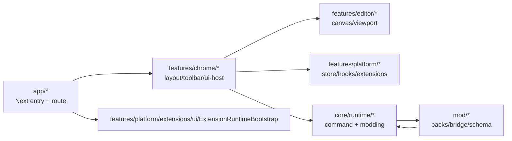
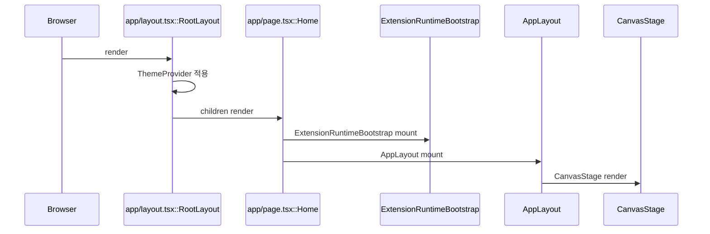
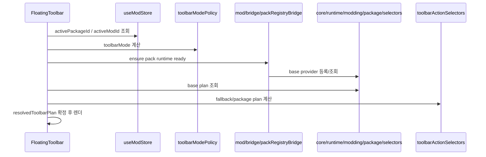
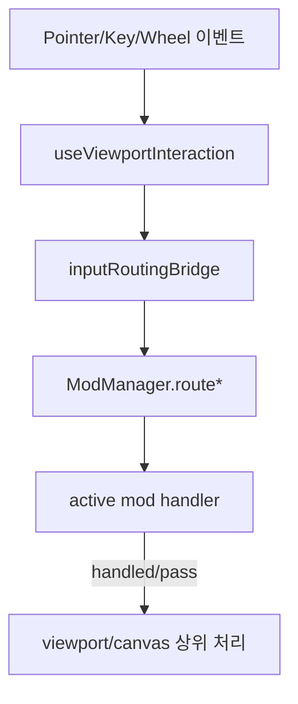

# 00. AS-IS System Flow Map

Status: ACTIVE BASELINE (Task 488)
Date: 2026-02-22
Scope: 현재 레포의 실제 구조/호출 흐름을 증거 기반으로 고정

---

## 1) Baseline Snapshot

- Source root: `v10/src`
- TS/TSX files: `386`
- Function declarations: `127`
- Class methods: `35`
- Variable declarations: `7767`
- Variable-assigned functions(arrow/function expr): `2096`

핵심 분포(파일 수 상위):
- `features/platform`: 97
- `features/chrome`: 64
- `features/editor`: 58
- `core/runtime`: 35
- `core/foundation`: 30
- `features/collaboration`: 31

---

## 2) Current Topology (Folder Ownership)

현재 구조 해석:
1. 앱 부팅은 `app`에서 시작.
2. 실제 사용자 셸은 `features/chrome`이 큰 비중으로 소유.
3. 모드/패키지 정의는 `mod/*` + `core/runtime/modding/*` 협업 구조.

---

## 3) Runtime Sequence A — App Boot

### 파일/함수 기준
- `v10/src/app/layout.tsx` -> `RootLayout()`
- `v10/src/app/page.tsx` -> `Home()`
- `v10/src/features/chrome/layout/AppLayout.tsx` -> `AppLayout()`

관찰:
- 엔트리 단계에서 이미 `ThemeProvider` + `ExtensionRuntimeBootstrap` + `AppLayout`이 연결됨.
- 셸/레이아웃 책임이 `features/chrome`에 집중.

---

## 4) Runtime Sequence B — Toolbar Plan Resolution

### 파일/함수 기준
- `v10/src/features/chrome/toolbar/FloatingToolbar.tsx`
  - `resolveToolbarModeFromActiveModId()`
  - `selectResolvedToolbarPlanInputFromBaseProvider()`
- `v10/src/features/chrome/toolbar/catalog/toolbarActionSelectors.ts`
  - `selectResolvedToolbarPlanInput()`
- `v10/src/mod/bridge/packRegistryBridge.ts`
  - `getPrimaryRuntimeTemplatePack()`
  - `registerRuntimeToolbarBaseProvider()`
- `v10/src/core/runtime/modding/package/selectors.ts`
  - `selectResolvedToolbarPlanInputFromBaseProvider()`
  - `resolveToolbarPlanFromActionSurfaceRules()`

관찰:
- 툴바 계획은 이미 `ResolvedToolbarPlan` 축으로 수렴 중.
- 단, 기능 코드는 여전히 `features/chrome/toolbar/*`에 많이 존재.

---

## 5) Runtime Sequence C — Mod Input Routing

### 파일/함수 기준
- `v10/src/features/editor/canvas/viewport/useViewportInteraction.ts`
  - `routeModPointerInput()` / `routeModWheelInput()` / `routeModKeyInput()` 호출
- `v10/src/core/runtime/modding/host/inputRoutingBridge.ts`
  - `toNormalizedModPointerEvent()` / `routeModPointerInput()` 등
- `v10/src/core/runtime/modding/host/manager.ts`
  - `routePointer()` / `routeKey()` / `routeWheel()`

관찰:
- 입력 브리지 경로는 존재하며 실제 viewport 레벨에서 호출됨.
- 코어 라우팅 브리지와 feature 입력 훅의 결합 지점이 명확.

---

## 6) Current SSOT Anchors

- Toolbar resolved plan type:
  - `v10/src/core/runtime/modding/package/types.ts` (`ResolvedToolbarPlan`)
- Runtime package registry:
  - `v10/src/core/runtime/modding/package/registry.ts`
- Runtime template-pack bridge:
  - `v10/src/mod/bridge/packRegistryBridge.ts`
- Active package/mod state:
  - `v10/src/features/platform/store/useModStore.ts`

---

## 7) Confirmed Constraints (as-is)

- Layer guard script: PASS
  - `scripts/check_layer_rules.sh`
- Mod contract guard script: PASS (with WARN for legacy compat alias usage)
  - `scripts/check_mod_contract.sh`

---

## 8) Known AS-IS Friction (summary only)

1. Toolbar policy path가 여러 파일에 분산되어 유지비용 높음.
2. `features/chrome`가 여전히 정책/행동 일부를 보유한 하이브리드 상태.
3. legacy alias fallback 경로가 남아 있어 완전한 pack-first로 아직 고정되지 않음.

상세 갭/리스크는 `02_Gap_Register_And_RiskMap.md` 참조.
