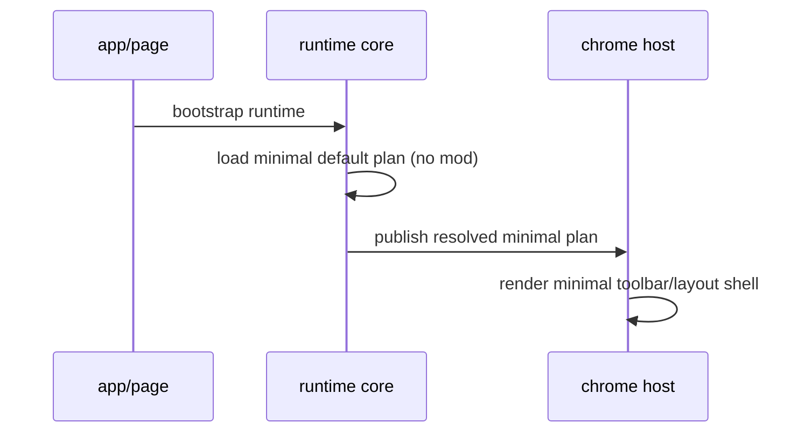
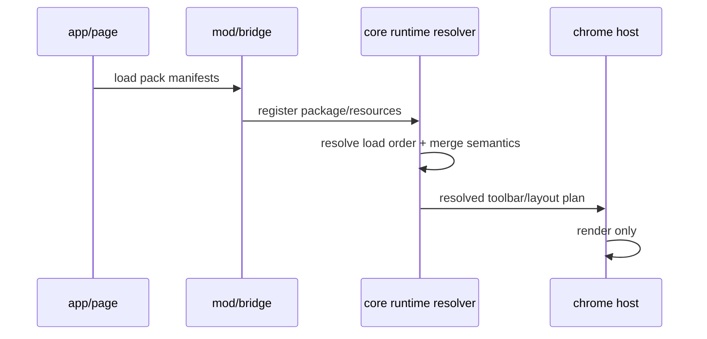

# 01. TO-BE Engine/Mod Flow Map

Status: TARGET ARCHITECTURE (Task 488)
Date: 2026-02-22
Scope: core always-on + mod optional + one-way dependency 목표 구조

---

## 1) Target Invariants (must hold)

1. Core engine는 모드 0개 상태에서도 항상 부팅 가능.
2. 모드는 optional이며, core가 특정 mod를 import/의존하지 않는다.
3. 의존성은 단방향:
   - `mod -> core(public API only)`
   - `core -X-> mod`
   - `core -X-> features`
   - `mod -X-> features`
4. Host(`features/chrome`)는 “결정”이 아니라 “렌더”를 담당.
5. Toolbar/Layout/UX 흐름은 최종적으로 pack/mod policy에서 파생.

---

## 2) Target Ownership Model

```mermaid
flowchart LR
  subgraph CoreAlwaysOn [Core Engine (Always On)]
    Runtime[core/runtime\ncommand + mod host + package resolver]
    Foundation[core/foundation\npolicy/schema/type]
    Canvas[editor runtime primitives\n(infinite canvas base)]
  end

  subgraph OptionalMods [Optional Mod Layer]
    PackCatalog[mod/packs\nmanifest/policy/resources]
    ModImpl[core/runtime/modding/builtin + external mod units]
  end

  subgraph HostRenderer [Host Renderer (No policy ownership)]
    Chrome[features/chrome/layout + toolbar + ui-host]
  end

  PackCatalog --> Runtime
  ModImpl --> Runtime
  Runtime --> Chrome
  Canvas --> Runtime
  Foundation --> Runtime
```

핵심:
- Host는 `Resolved*Plan` 렌더러.
- 정책/합성/우선순위는 runtime resolver에서만 결정.

---

## 3) One-way Import Rules (Contract)

### Allowed
- `features/* -> core/*(public)`
- `mod/* -> core/runtime/modding/*(public)`
- `mod/* -> mod/schema/*`

### Forbidden
- `core/* -> features/*`
- `core/* -> mod/*`
- `mod/* -> features/*`
- `mod/* -> mod/*` direct runtime import (선언형 의존만 허용)
- `features/* -> core/runtime/modding/**/internal/*`

---

## 4) TO-BE Runtime Sequence

### 4.1 No-mod boot (engine minimal mode)



### 4.2 Mod-enabled boot



---

## 5) Resource Merge Semantics (target)

리소스별로 merge 규칙을 분리한다.

1. Policy JSON:
   - field-level merge (base < package < mod < user)
2. Toolbar items:
   - key: `(slotId, itemId)`
   - add/override/remove
3. Commands:
   - 기본 충돌 금지, 명시 override만 허용
4. Shortcuts:
   - 충돌 진단(winner/loser) 필수
5. Input behavior:
   - last-wins 금지
   - handled/pass chain 또는 active/exclusive 정책 사용

---

## 6) Target split: Mod Studio vs Mod Manager

- Mod Studio (Authoring):
  - 모드 제작/정의/검증
- Mod Manager (Consumption):
  - 설치/활성화/로드오더/충돌진단/실행 정책

UI는 분리해도 되지만, 계약은 동일 runtime resolver를 공유해야 한다.

---

## 7) Acceptance Signals for TO-BE readiness

1. Host에서 툴바/레이아웃 정책 하드코딩 참조가 0.
2. `ResolvedToolbarPlan` 없이 host 렌더가 불가능(컴파일 타임 계약).
3. legacy alias fallback 발동 시 telemetry/warn이 기록.
4. 모드 0개 부팅 테스트가 통과.
5. guardrail 스크립트에서 one-way import 규칙 위반이 0.
