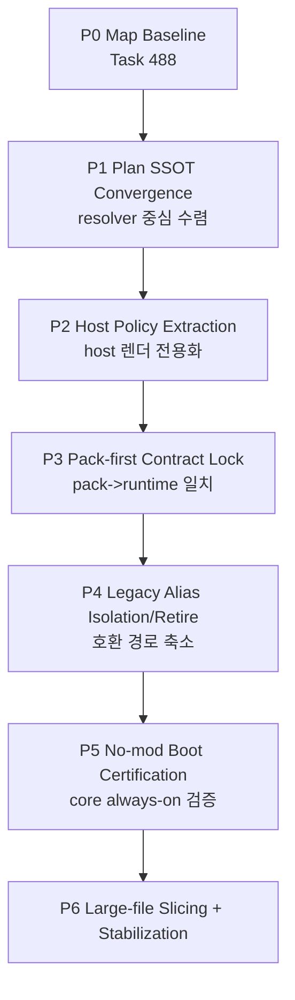

# 03. Refactor DAG Execution Plan

Status: ACTIVE EXECUTION DAG (Task 488)
Date: 2026-02-22
Scope: AS-IS/TO-BE/GAP 기반의 점진 리팩토링 순서를 DAG로 고정

---

## 1) DAG Principles

1. Big-bang 금지 (작은 PR 단위)
2. behavior-preserving 단계 선행
3. SSOT 수렴 후 기능 이관
4. 검증 자동화(guardrail + regression check) 동반

---

## 2) Execution DAG (Phase View)

---

## 3) Phase detail

### P0 — Map Baseline
- Input:
  - `00_AsIs_SystemFlowMap.md`
  - `01_ToBe_EngineModFlowMap.md`
  - `02_Gap_Register_And_RiskMap.md`
- Output:
  - 기준선 고정 완료
- Gate:
  - 문서 cross-link 정합

### P1 — Plan SSOT Convergence
- Goal:
  - 툴바 결정 경로를 resolver 기준으로 단일화
- Blocking risk:
  - `toolbarModePolicy/actionCatalog/surfacePolicy` 삼중 소유
- Verify:
  - host에서 정책 직접 참조 수 감소/0

### P2 — Host Policy Extraction
- Goal:
  - `features/chrome`를 plan renderer로 축소
- Blocking risk:
  - AppLayout/FloatingToolbar 내부 정책 분기
- Verify:
  - host는 `ResolvedToolbarPlan` 입력 없이는 렌더 불가

### P3 — Pack-first Contract Lock
- Goal:
  - pack 선언이 runtime에 1:1 반영되도록 계약 고정
- Blocking risk:
  - dead config/누락 매핑
- Verify:
  - pack 정의 항목별 반영 검증 테스트

### P4 — Legacy Alias Isolation/Retire
- Goal:
  - compat alias를 격리하고 제거 로드맵 고정
- Blocking risk:
  - 기존 사용자 흐름 회귀
- Verify:
  - alias fallback telemetry 경고 + 점진 제거

### P5 — No-mod Boot Certification
- Goal:
  - 모드 0개 상태에서도 core 항상 부팅
- Blocking risk:
  - base pack 하드 의존
- Verify:
  - no-mod boot smoke test pass

### P6 — Large-file Slicing + Stabilization
- Goal:
  - 대형 파일 분해 + 경계 유지
- Blocking risk:
  - 분해 중 책임 혼선
- Verify:
  - layer/mod contract guard 지속 PASS

---

## 4) Parallelization policy

- 병렬 가능:
  - 같은 phase 내에서도 파일 소유권이 분리된 경우만
- 병렬 금지:
  - `AppLayout.tsx`, `FloatingToolbar.tsx`, resolver/selectors 핵심 파일 동시 수정

권장 슬롯 정책:
1. critical-path 파일은 직렬
2. 분해 대상/테스트 문서/가드 스크립트는 병렬

---

## 5) Verification matrix by phase

| Phase | Required check |
|---|---|
| P1 | resolver 경로 일원화 증거(rg + unit/manual) |
| P2 | host 정책 하드코딩 참조 0 또는 명시적 예외만 |
| P3 | pack 선언-반영 일치 체크 |
| P4 | alias fallback metric/warn 확인 |
| P5 | no-mod boot pass |
| P6 | `check_layer_rules`, `check_mod_contract`, lint/build pass |

---

## 6) Rollback rules

1. 각 phase는 독립 롤백 가능해야 한다.
2. 핵심 selector/plan 파일 변경은 feature-flag 또는 adapter fallback 유지.
3. rollback 시 문서 GAP 상태를 즉시 재마킹한다.

---

## 7) Definition of Done (program-level)

다음 5개가 동시에 성립하면 본 DAG 프로그램을 종료 가능:

1. core always-on + no-mod boot 보장
2. host는 resolved plan 렌더러 역할만 수행
3. pack/mod는 core public API만 사용
4. toolbar/layout 정책 SSOT 단일화
5. guardrail 검사 + 운영 회귀 검사 상시 PASS
