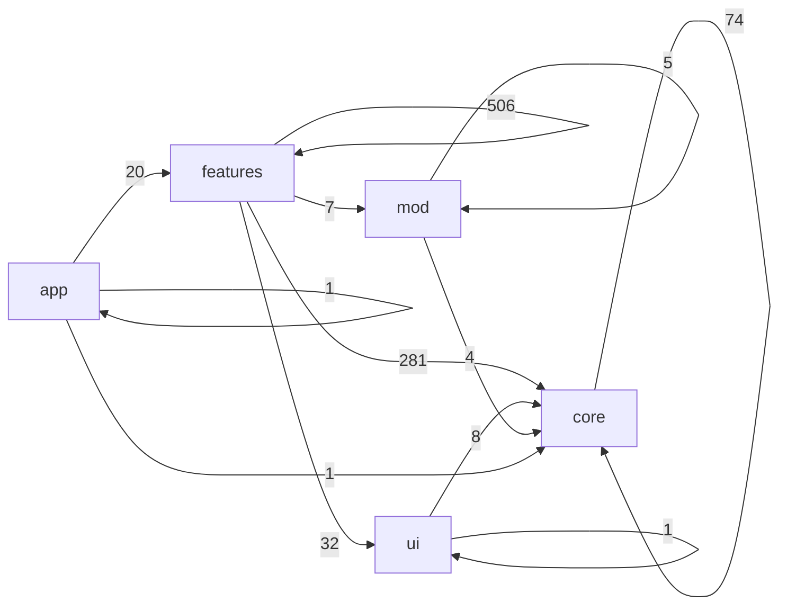

# 04. Symbol Dependency Map

Status: ACTIVE GENERATED MAP (Task 489)
Date: 2026-02-22
Generator: `scripts/gen_symbol_dependency_map.mjs`

---

## 1) 목적

이 문서는 `v10/src` 기준으로:
1. 폴더 의존성 경로
2. 파일 의존성 경로
3. 함수/변수/메서드 정의 인덱스
를 자동 생성해, 리팩토링 난이도를 낮추기 위한 기반 맵을 제공한다.

---

## 2) Totals (current snapshot)

- Files: **386**
- Function declarations: **127**
- Class methods: **35**
- Variable declarations: **7767**
- Variable-assigned function-like: **2096**

---

## 3) Folder Dependency Flow (Top edges)



| From | To | Count |
|---|---|---:|
| features | features | 506 |
| features | core | 281 |
| core | core | 74 |
| features | ui | 32 |
| app | features | 20 |
| ui | core | 8 |
| features | mod | 7 |
| mod | mod | 5 |
| mod | core | 4 |
| app | app | 1 |
| app | core | 1 |
| ui | ui | 1 |

---

## 4) Symbol Hotspots (Top 30 by load)

Load = functionDecl + classMethod + variableAssignedFunction

| File | Load | functionDecl | classMethod | variableAssignedFunction |
|---|---:|---:|---:|---:|
| `core/runtime/modding/package/selectors.ts` | 72 | 0 | 0 | 72 |
| `features/collaboration/sharing/snapshotSerializer.ts` | 38 | 0 | 0 | 38 |
| `features/chrome/layout/windowing/windowRuntime.ts` | 37 | 0 | 0 | 37 |
| `app/api/community/route.ts` | 34 | 2 | 0 | 32 |
| `features/platform/extensions/ui/ExtensionRuntimeBootstrap.tsx` | 34 | 1 | 0 | 33 |
| `core/runtime/modding/package/registry.ts` | 31 | 0 | 8 | 23 |
| `core/foundation/schemas/community.ts` | 29 | 0 | 0 | 29 |
| `core/pipelines/migrations/migrateToV2.ts` | 29 | 1 | 0 | 28 |
| `features/platform/extensions/adapters/providerAbi.ts` | 29 | 0 | 0 | 29 |
| `core/runtime/command/commandBus.ts` | 26 | 0 | 0 | 26 |
| `core/runtime/modding/host/manager.ts` | 26 | 0 | 9 | 17 |
| `features/editor/input-studio/offlineDraftQueue.ts` | 26 | 0 | 0 | 26 |
| `features/platform/extensions/commands/commands.doc.ts` | 26 | 1 | 0 | 25 |
| `features/platform/extensions/commands/commands.tool.ts` | 26 | 1 | 0 | 25 |
| `features/platform/extensions/jobs/asyncJobOrchestrator.ts` | 26 | 0 | 0 | 26 |
| `core/runtime/plugin-runtime/mcpGateway.ts` | 25 | 0 | 0 | 25 |
| `core/foundation/policies/rolePolicy.ts` | 24 | 0 | 0 | 24 |
| `features/platform/extensions/commands/commands.playback.ts` | 23 | 1 | 0 | 22 |
| `features/platform/extensions/commands/commands.canvas.ts` | 22 | 1 | 0 | 21 |
| `features/platform/store/useCanvasStore.ts` | 22 | 0 | 0 | 22 |
| `features/platform/store/useSyncStore.ts` | 22 | 0 | 0 | 22 |
| `core/foundation/schemas/multimodalAsset.ts` | 21 | 0 | 0 | 21 |
| `core/runtime/plugin-runtime/aiOutputAssetPipeline.ts` | 20 | 0 | 0 | 20 |
| `features/chrome/layout/dataInput/blockDraft.ts` | 20 | 0 | 0 | 20 |
| `core/ui/theming/presets/presets.ts` | 19 | 0 | 0 | 19 |
| `features/chrome/layout/windowing/panelPolicy.runtime.ts` | 19 | 0 | 0 | 19 |
| `features/platform/observability/auditLogger.ts` | 19 | 0 | 0 | 19 |
| `core/runtime/modding/package/templatePackAdapter.ts` | 18 | 0 | 0 | 18 |
| `core/runtime/plugin-runtime/pluginLoader.ts` | 18 | 0 | 0 | 18 |
| `core/runtime/plugin-runtime/registry.ts` | 18 | 0 | 0 | 18 |

---

## 5) Symbol Type Definitions

- **functionDecl**: `function foo() {}` 형태의 선언 함수
- **classMethod**: 클래스 내부 메서드
- **variableDecl**: `const/let/var` 선언
- **variableAssignedFunction**: 변수 초기값이 화살표 함수/함수표현식인 경우

---

## 6) Full Dataset Paths

- `v10/docs/architecture/generated/symbol_inventory.json`
- `v10/docs/architecture/generated/folder_dependency_edges.json`
- `v10/docs/architecture/generated/file_dependency_edges.json`

---

## 7) Re-generate

```bash
node scripts/gen_symbol_dependency_map.mjs
```

---

## 8) Practical Reading Order

1. `00_AsIs_SystemFlowMap.md` (현재 실행 흐름)
2. `01_ToBe_EngineModFlowMap.md` (목표 구조)
3. `02_Gap_Register_And_RiskMap.md` (어긋남)
4. **`04_Symbol_Dependency_Map.md` (전수 인덱스 진입점)**
5. `03_Refactor_DAG_ExecutionPlan.md` (실행 순서)
