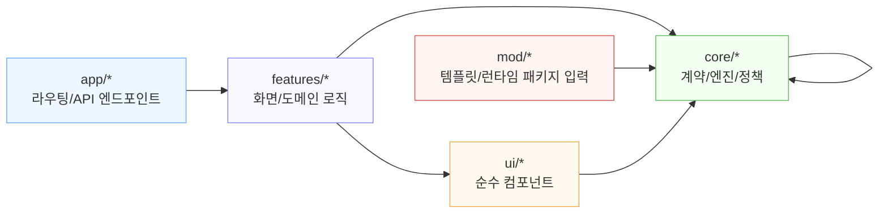
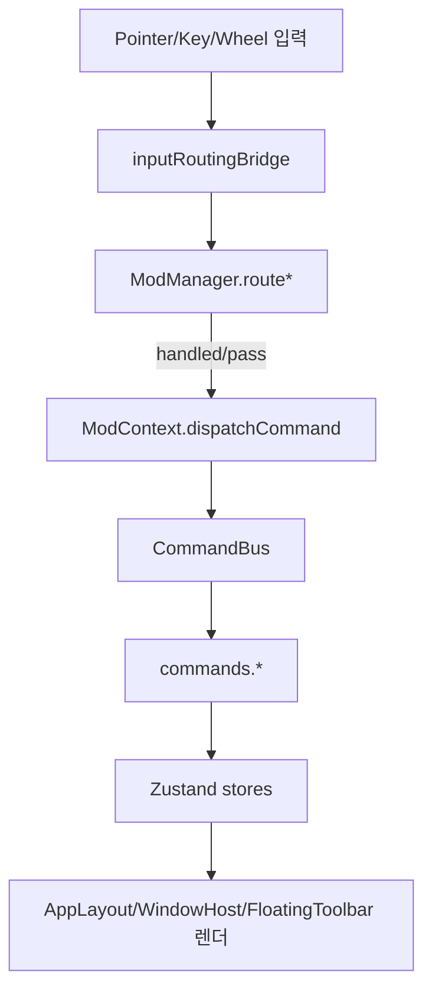
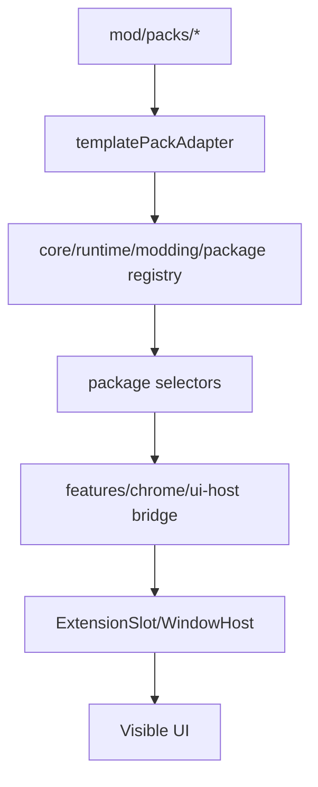
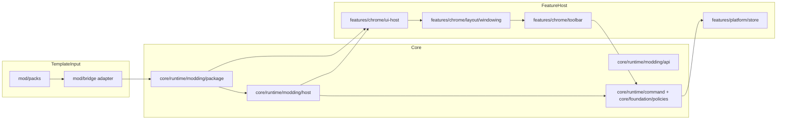
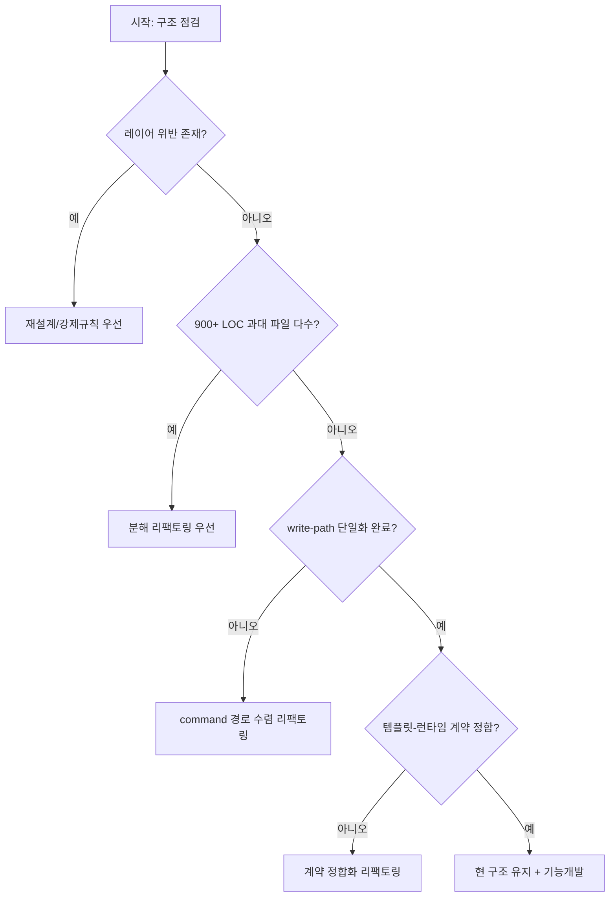

# Modularization Dependency Flow (v10)

Status: ACTIVE  
Purpose: 폴더/함수 의존성 전선정리용 운영 문서 (리팩토링 의사결정 보조)  
Date: 2026-02-21

---

## 1) 결론 먼저

- **전체 재설계(갈아엎기): 불필요**
- **점진 리팩토링(전선정리): 필요**

판정 근거:
- 레이어/모드 경계 검사 PASS (`check_layer_rules`, `check_mod_contract`)
- 그러나 대형 파일(900+ LOC)과 과도기 브리지 경로가 남아 있어 유지보수 복잡도는 높음

---

## 2) 수학적 관점의 구조 판정

모듈 그래프를 다음처럼 본다.

- 그래프: `G = (V, E)`
  - `V`: 폴더/모듈 노드 (`core`, `features`, `ui`, `app`, `mod`)
  - `E`: import/call edge
- 목표함수(이상형):
  - `min C = w1*B + w2*O + w3*R`
    - `B`: 레이어 위반 edge 수
    - `O`: 과대 파일 수(>900 LOC)
    - `R`: 과도기 브리지/중복 write-path 잔량

현재 측정(핵심 지표):
- `B = 0` (경계 위반 없음)
- `O = 7` (900 LOC 초과 파일 7개)
- `R > 0` (`check_v10_command_write_path`에서 UI 경유 잔량 존재)

해석:
- `B`가 0이므로 **아키텍처 방향은 맞다**.
- `O`, `R`이 커서 **운영 복잡도는 아직 높다**.
- 따라서 **재설계보다 분해 리팩토링이 최적해**.

---

## 3) 현재 폴더 토폴로지 (책임 기준)

의존성 규칙(요약):
- `core -> core` only
- `ui -> ui/core`
- `features -> core/ui`
- `app -> features/ui`
- `mod(packs/bridge/schema) -> core(mod package/contracts)`  

---

## 4) 함수 의존성 순서도 (실행 경로)

### 4.1 입력/행동 경로

### 4.2 정책/패키지 경로

---

## 5) 관찰된 복잡도 병목

### 5.1 파일 크기 병목 (900+ LOC)

대표 파일:
- `core/foundation/schemas/community.ts` (1604)
- `features/chrome/layout/DataInputPanel.tsx` (1264)
- `features/platform/hooks/useCanvas.ts` (1046)
- `features/platform/store/useCanvasStore.ts` (1033)
- `core/runtime/plugin-runtime/mcpGateway.ts` (1005)
- `app/api/community/route.ts` (977)
- `features/platform/extensions/ui/ExtensionRuntimeBootstrap.tsx` (942)

해석:
- 기능은 동작하나, 수정 단위가 커서 회귀 확률 증가.

### 5.2 과도기 write-path 병목
- `check_v10_command_write_path`에서 UI 경유 잔량 존재.
- 즉, “command 단일 write path”가 아직 100% 수렴하지 않음.

### 5.3 계약 정합성 병목
- 런타임에서 제거된 구식 도킹 액션과 템플릿 계약의 잔존 가능성.
- 모더 입장에서 “무엇이 실제 동작 규격인지” 혼선 가능.

### 5.4 테마 하드코딩 잔량
- 토큰 체계 바깥 하드코딩 컬러가 일부 경고로 남아 있음.

---

## 6) 이상적인 목표 구조 (변경 최소형)

핵심 원칙:
- 상태 SSOT와 결정 SSOT를 분리:
  - 상태: store
  - 결정: resolver/policy
- UI는 결과만 렌더, 판단은 하지 않음.

---

## 7) 리팩토링 필요성 판정 플로우

현재 v10 위치:
- `레이어 위반 없음` -> `과대 파일/경로 수렴/계약 정합화` 단계.

---

## 8) 실행 우선순위 (권장)

1. **정합화**: 템플릿 계약과 런타임 액션 동기화  
2. **수렴화**: command-only write path 확대  
3. **슬라이싱**: 900+ LOC 파일 분해  
4. **정제**: 토큰 외 하드코딩 컬러 제거  
5. **고정**: 재유입 방지 게이트 강화

---

## 9) 최종 판단

- 지금은 “구조를 갈아엎을 시점”이 아니라,  
  **현재 좋은 구조를 유지한 채 병목 구간만 수학적으로 줄이는 시점**이다.
- 즉, **대수술(재설계)**보다 **전선정리(분해/정합화/수렴화)**가 최적.
